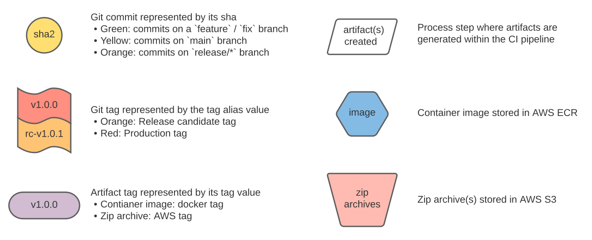
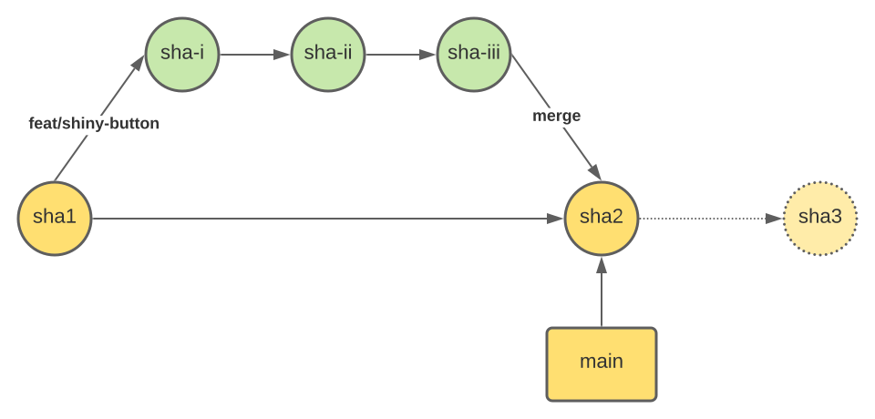
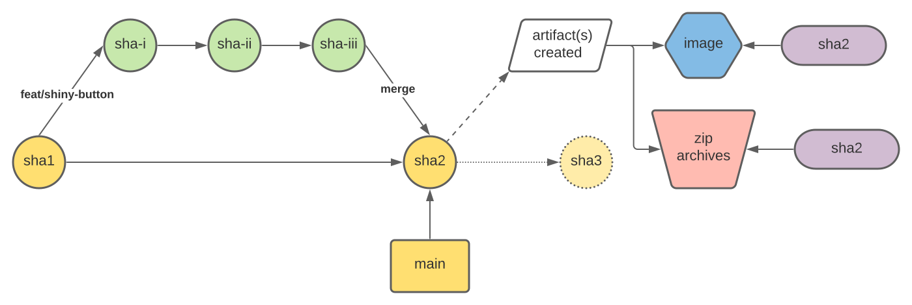
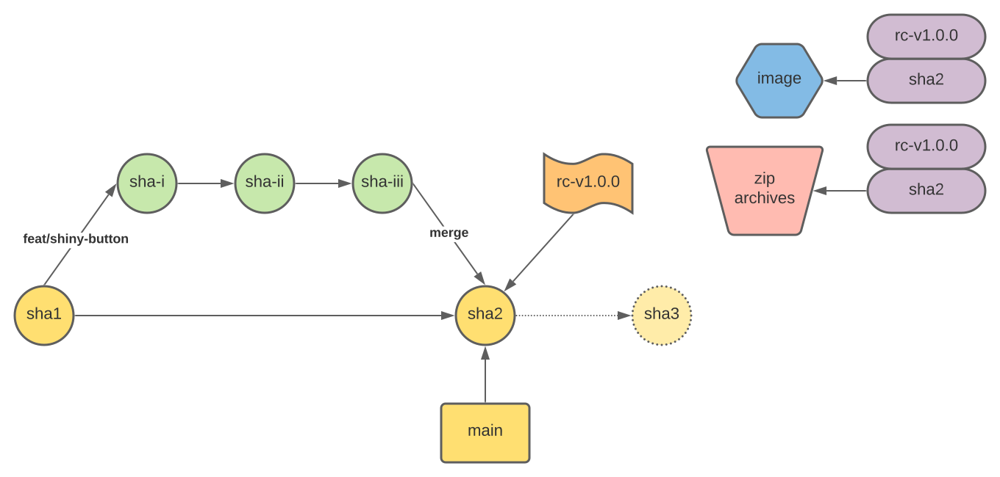
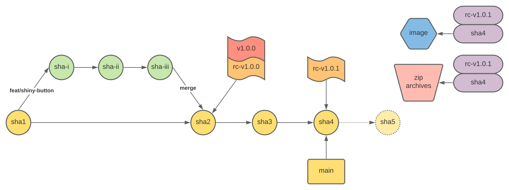
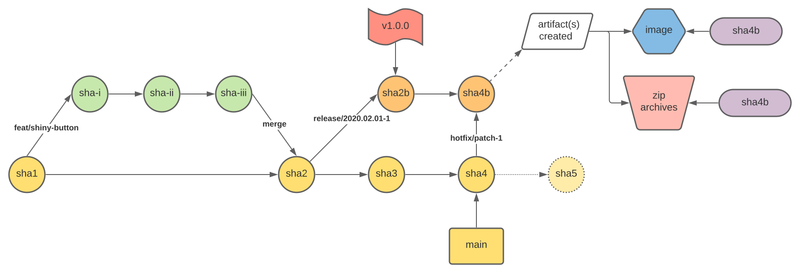
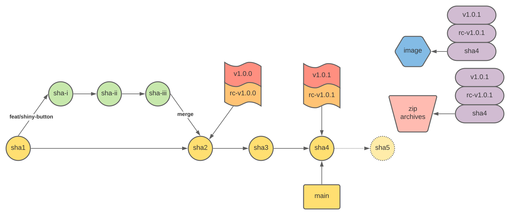
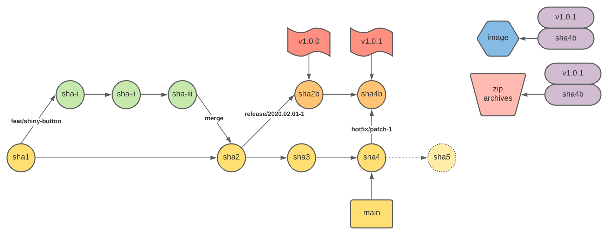

## Table of Contents

- [Ideology](#ideology)
- [Assumptions](#assumptions)
- [Caveats](#caveats)
- [Workflow](#workflow)
  - [Legend](#legend)
  - [Step 1](#step-1)
  - [Step 2](#step-2)
  - [Step 3](#step-3)
  - [Step 4](#step-4)
  - [Step 5](#step-5)

## [Ideology](#table-of-contents)

- Protect `main` at all costs. If a pull-request passes all checks and approvals to merge into `main`, it should be ready to go to straight into `prod` as is
- No code freezes; `main` never stops, always traveling forward. Artifacts can be used to rollback to a previous version if necessary.
- Build once, deploy many. Artifacts generated by the CI pipeline are built once per commit on `main` so that there is a clear and traceable lineage between the commit and the artifact(s) created. Artifacts are promoted to downstream environments using tags

## [Assumptions](#table-of-contents)

- There are two types of artifacts that are discussed below:
  - [OCI compliant images](https://opencontainers.org/) used for containers running on AWS EKS
  - Zip archives used by AWS Lambda functions generated/managed by the Serverless framework
- For CD or deployment in general:
  - ArgoCD is used for ensuring changes to container images are reflected in their respective environments through a [GitOps style workflow](https://argoproj.github.io/argo-cd/)
    - The process described below assumes ArgoCD is used for continuous deployment when changes are detected in the manifest repository
  - Serverless framework is used for managing lambda function deployments
- A [manifest repository](https://www.weave.works/docs/cloud/latest/tasks/deploy/manifests/) is a repository separate from application code where Kubernetes manifest files (standard K8s yaml files, Helm charts, Kustomize files, etc.) are stored and managed

## [Caveats](#table-of-contents)

- When using a [filter/event pattern](https://docs.github.com/en/actions/reference/events-that-trigger-workflows#example-using-multiple-events-with-activity-types-or-configuration) to determine whether an artifact should be created or not, users should be mindful of the commit that is selected for promotion. If a commit is selected that did not generate an artifact (i.e. - a commit that only updates documentation and therefore no artifact was generated), there won't be anything to promote to the downstream environments and those workflows will fail.
  - A simple check step can be added to send a message/notification to cover this edge case
- Semantic versioning is shown below, but semantic versioning is not a requirement. In most instances, calendar versioning might prove more useful than semantic versioning if there aren't any consumers of the product/service (i.e. - no parties relying on a version contract for compatibility)

## [Workflow](#table-of-contents)

### Legend

  

---

### [Step 1](#table-of-contents)

All pull-requests start by branching off of `main` (the base of the pull-request should always point to `main`).

- the `main` branch is the one and only source of truth - it should represent the lineage of the codebase and application(s)/service(s)
- `main` is 🚧 🛑 ✋ heavily protected 🚧 - anything that is approved to go into `main` is ready for the prime time to go to production. This means judicious use of featuring flagging and stage gating changes that are not yet fully ready to be used by or available to consumers. Testing that is performed on the pull-request is meant to target the service(s) itself (i.e. - independent testing of the microservice(s) affected by the change) including any contracts the service(s) is intended to adhere to and/or provide (test each piece separately)

  

---

### [Step 2](#table-of-contents)

Merging a pull-request into `main` updates the service(s) in `stage`

`stage` is a protected environment and developers should not have access to modify. This is a critical step in rehearsing for production.
`stage` is intended to be used for final validation, and automated end-to-end integration testing (how do the pieces come together as a whole).
If any tests fail during `stage` checks, the user/team who introduced the error/issue needs to be contacted immediately to get it corrected.
`main`/`stage` must always be healthy, clean, and ready to go to `prod`. _IF_ there is a commit that is on `main` that is failing validation,
the artifacts associated with that commit should be deleted to avoid any possibility of deployment to downstream environments (i.e. - yank the version).

Once a pull-request is merged into `main`:

- An artifact(s) is built and pushed up AWS ECR and tagged with the commit sha (short sha)
  - Container image workflows:
    - The artifact is an OCI compliant image stored in ECR
    - The manifest repository for the associated application/service and environment is updated with the new container tag
    - ArgoCD detects this change in the manifest repo and updates the `stage` environment using the associated image
  - Serverless/lambda workflow:
    - The artifact is a zipped archive for the lambda function(s) stored in S3
    - The zip archives created by this deployment are stored in a shared S3 bucket and tagged with the commit sha
      - `sls package --package ${GIT_SHA}`
      - `aws s3 cp ${GIT_SHA} s3://shared-serverless-artifacts`
    - The Serverless framework uses this package to deploy to and update the `stage` environment
      - `sls deploy -s stage -p ${GIT_SHA}`

  

---

### [Step 3](#table-of-contents)

Tagging a commit on `main` with a tag matching the pattern `rc-*` updates the service(s) in `demo`

(In theory the tag can be any pattern such as `demo-*`, as long as convention is enforced and followed)

The `demo` environment is intended for training internal support personnel and allowing previews to select users. It should be a very stable environment
so that users have a good, reliable experience - it is not intended to be "another QA environment". Tagging this environment separately allows for teams
to offer "early access previews" for external parties to view and interact with the application ahead of the general audience receiving the updates.

Once a commit on `main` has been tagged with a git tag matching the pattern `rc-*`:

- Container workflow:
  - The existing artifact associated with the selected git commit sha is (docker) tagged with the git tag `rc-*` value and pushed to AWS ECR
  - The manifest repository for the associated application/service is updated with the new `rc-*` tag
  - ArgoCD detects this change in the manifest repo and updates the `demo` environment using the associated image
- Serverless workflow:
  - The existing artifacts associated with the selected git commit sha is referenced when deploying using the Serverless framework into the `demo` environment
    - `aws s3 sync s3://shared-serverless-artifacts/${GIT_SHA} ${GIT_SHA}`
    - `sls deploy -s demo -p ${GIT_SHA}`

  

<h3>⚠️ Step 3b ⚠️</h3>

<em>This is an alternate route but not preferred/recommended.</em>

An alternate method could utilize a `release/*` branch to allow for:

1. The ability to queue a set of selected changes that are intended to go to production that may not follow the same lineage as `main`
2. The ability to "hotfix" production without including new/additional changes other than whats needed to fix production due to a lineage that differs from `main`

This tends to be a common pattern but it should be thought of as a crutch for not adhering to strict practices of keeping `main` always ready to go to production. If feature flagging and/or feature gating practices are followed, there shouldn't be any need to have a `release/*` branch.

The downsides of this approach are:

- Changes are not made directly on this branch, they are merged into `main` and then they must be cherry-picked into the `release/*` branch
- If there is a series of commits to be promoted to the downstream environments, if one commit in a series of commits is is not ready to go forward then developers have to carefully cherry pick the necessary commits (or only promote the commit before the offending commit)
- A new image needs to be built and tested for each commit on this `release/*` branch (more time/effort, moving parts)
- This new image is not reflected anywhere on `main` since its built and referenced from an ephemeral branch with a different lineage. Therefore, when rolling back to a previous version, users must be very cautious when selecting the appropriate commit to roll back to

Again, front-loading the testing and validation for getting a pull-request into `main` is critical, followed by integration/smoke tests once deployed to `stage`. This will ensure that `main` is always in a clean, healthy state and ready to deploy to production.

  

---

### [Step 4](#table-of-contents)

(This step is intended to reinforce the ideas explained above)

When the need arises to patch an issue identified in the field (whether that be in `demo` by internal users, or in production), the change is applied through the standard process:

- Create a temporary branch off of `main` (i.e. `fix/click-bug`)
- Open a pull request - ensure tests/checks pass, seek approval, etc.
- Once the change has been merged, validate in `stage`
- Create a tag to promote to `demo` as needed
- Create a tag to promote to `prod` as needed

There is no need to try to cherry-pick only the hotfix commit since the practice of always ensuring `main` is ready to go to `prod` is being followed. In theory this is not a "hotfix" but instead "just another commit" that happens to fix an issue that was identified. There is nothing special about it - nor anything special about the process of getting the fix into production. As long as the process of keeping `main` clean, healthy, and ready to go to production, changes are able to come into `main` and be promoted up to production very quickly and without any hassle.

  

<h3>⚠️ Step 4b ⚠️</h3>

<em>This is an alternate route but not preferred/recommended.</em>

If following the alternate flow in 3b, there must be an associated alternate flow for allowing hotfixes. If the process is not followed as defined in 3b, there is no need to worry about how to handle "hotfixes".

When the need arises to patch an issue in production, and due to the nature of the separate `release/*` branch process utilized, a hotfix must be merged into `main` and then subsequently cherry-picked into the `release/*` branch so that any additional changes are not inadvertently introduced.

- Create a temporary branch off of `main` (i.e. `fix/click-bug`)
- Open a pull request - ensure tests/checks pass, seek approval, etc.
- Once the change has been merged, validate in `stage`
- Cherry pick the hotfix commit from the `main` branch into the `release/*` branch
- Once the hotfix commit lands on the `release/*` branch, this should trigger the creation of a new artifact(s) to be created and deployed to the `demo` environment
- If the change is validated and the issue resolved, the hotfix commit of the `release/*` branch can be tagged to promote to production (continue in 5b)

The downsides of this approach:

- We are not respecting the stability of the `demo` environment as a pre-prod, showcase environment but instead using it as a secondary QA environment
- Developers have to follow a lengthier and slightly riskier workflow to get their hotfix change promoted to the appropriate environment
- A new image needs to be built and tested for each commit on this `release/*` branch (more time/effort, moving parts)
- This new image is not reflected anywhere on `main` since its built and referenced from an ephemeral branch with a different lineage. Therefore, when rolling back to a previous version, users must be very cautious when selecting the appropriate commit to roll back to

  

---

### [Step 5](#table-of-contents)

Tagging a commit on `main` with a tag matching the pattern `v*` (i.e. `v1.0.0`) updates the service(s) in `prod`
Unlike the `demo` environment tag convention - this is a widely accepted practice that should not deviate.

Once a commit on `main` has been tagged with a git tag matching the pattern `v*`:

- Container workflow:
  - The existing artifact associated with the selected git commit sha is (docker) tagged with the git tag `v*` value and pushed to AWS ECR
  - The manifest repository for the associated application/service is updated with the new `v*` tag
  - ArgoCD detects this change in the manifest repo and updates the `prod` environment using the associated image
- Serverless workflow:
  - The existing artifacts associated with the selected git commit sha is referenced when deploying using the Serverless framework into the `prod` environment
    - `aws s3 cp s3://shared-serverless-artifacts/${GIT_SHA} ${GIT_SHA}`
    - `sls deploy -s prod -p ${GIT_SHA}`

  

<h3>⚠️ Step 5b ⚠️</h3>
This is an alternate route but not preferred/recommended:

Continuing the alternate flow in 3b & 4b; this is the final alternate route step to deploy to production.

This process largely reflects that of step 4 except with the caveat that the associated `release/*` branch is tagged instead of the `main` branch. Once a commit on `release/*` has been tagged with a git tag matching the pattern `v*`:

- Container workflow:
  - The existing artifact associated with the selected git commit sha is (docker) tagged with the git tag `v*` value and pushed to AWS ECR
  - The manifest repository for the associated application/service is updated with the new `v*` tag
  - ArgoCD detects this change in the manifest repo and updates the `prod` environment using the associated image
- Serverless workflow:
  - The existing artifacts associated with the selected git commit sha is referenced when deploying using the Serverless framework into the `prod` environment
    - `aws s3 cp s3://shared-serverless-artifacts/${GIT_SHA} ${GIT_SHA}`
    - `sls deploy -s prod -p ${GIT_SHA}`

  

